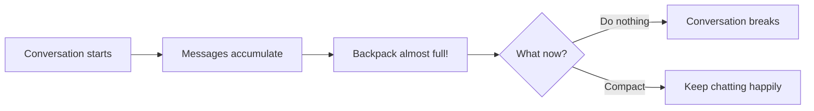
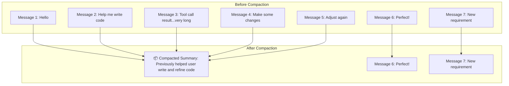
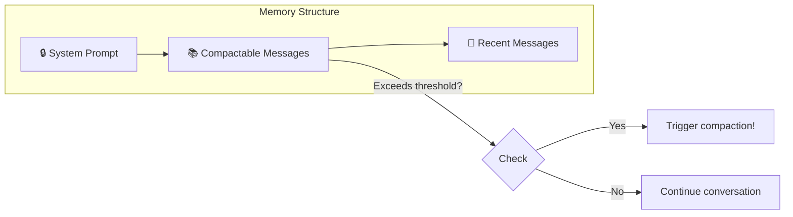
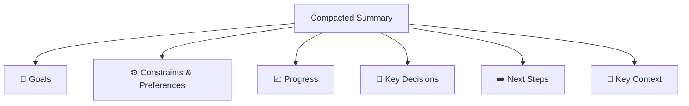

# Compaction

## Background: Why Do We Need Compaction?

Imagine the LLM's context window as a **backpack with limited capacity** 🎒. Every conversation turn, every tool call result adds something to the backpack. As the conversation goes on, the backpack gets fuller and fuller...



What happens when the backpack is full?

- 🚫 **Conversation interrupted** - Unable to continue the exchange
- 📉 **Quality degradation** - The AI starts "forgetting"
- ❌ **API errors** - Outright failure

**Compaction** is the magic that helps you "tidy up your backpack" ✨ — packing old items into a small box (summary), freeing up space for new things!

## What Is Compaction?

Compaction is like writing **meeting minutes**: condensing a lengthy discussion into key takeaways, while keeping recent conversation content unchanged.



After compaction, subsequent requests use:

- 📦 **Compacted summary** (replacing old messages)
- 💬 **Recent messages** (kept as-is)

The compacted summary is persisted, so you don't need to worry about losing it!

> The compaction mechanism is inspired by [OpenClaw](https://github.com/openclaw/openclaw) and implemented by [ReMe](https://github.com/agentscope-ai/ReMe).

## Configuration

### Environment Variables

| Environment Variable               | Default  | Description                                                            |
| ---------------------------------- | -------- | ---------------------------------------------------------------------- |
| `NANOSPARK_MEMORY_COMPACT_THRESHOLD`   | `100000` | Token threshold that triggers auto-compaction (capacity warning line)  |
| `NANOSPARK_MEMORY_COMPACT_KEEP_RECENT` | `3`      | Number of recent messages to keep after compaction                     |
| `NANOSPARK_MEMORY_COMPACT_RATIO`       | `0.7`    | Threshold ratio for triggering compaction (relative to context window) |

## When Does Compaction Trigger?

NanoSpark offers two compaction modes: **automatic** and **manual** 🚗

### 1. 🤖 Auto Compaction (When Approaching the Context Threshold)

NanoSpark acts like a thoughtful butler, checking how much space is left in the "backpack" before each conversation turn. When the token count of compactable messages exceeds the threshold, it automatically tidies up for you!

**Memory Structure Diagram:**



| Region                      | Description                 | Handling                                                               |
| --------------------------- | --------------------------- | ---------------------------------------------------------------------- |
| 🔒 **System Prompt**        | The AI's "persona guide"    | Always retained, never compacted                                       |
| 📚 **Compactable Messages** | Historical conversation log | Token count calculated; compacted into summary when threshold exceeded |
| 💬 **Recent Messages**      | Last N messages             | Kept as-is (N configured by `KEEP_RECENT`)                             |

### 2. 🎮 Manual Compaction (/compact Command)

Sometimes you want to proactively "clean out your backpack"? No problem! Send the magic spell:

```
/compact
```

After execution, you'll see a response like this:

```
**Compact Complete!**

- Messages compacted: 12
**Compressed Summary:**
<compacted summary content>
- Summary task started in background
```

Response breakdown:

- 📊 **Messages compacted** - How many messages were compacted
- 📝 **Compressed Summary** - The generated summary content
- ⏳ **Summary task** - A background task also starts to store the summary into long-term memory

## Compaction Content: What's in the Summary?

The compacted summary is like a **project handover document**, containing all the key information needed to continue working:



| Section                          | Content                                 | Example                                        |
| -------------------------------- | --------------------------------------- | ---------------------------------------------- |
| 🎯 **Goals**                     | What the user wants to accomplish       | "Build a user login system"                    |
| ⚙️ **Constraints & Preferences** | Requirements the user mentioned         | "Use TypeScript, no frameworks"                |
| 📈 **Progress**                  | Completed / in-progress / blocked tasks | "Login API done, registration API in progress" |
| 🔑 **Key Decisions**             | Decisions made and their rationale      | "Chose JWT over Sessions for statelessness"    |
| ➡️ **Next Steps**                | What to do next                         | "Implement password reset feature"             |
| 📌 **Key Context**               | Data needed to continue work            | "Main file is at src/auth.ts"                  |

> 💡 **Tip**: Compaction preserves exact file paths, function names, and error messages, ensuring the AI doesn't "lose its memory" and context transitions seamlessly!
